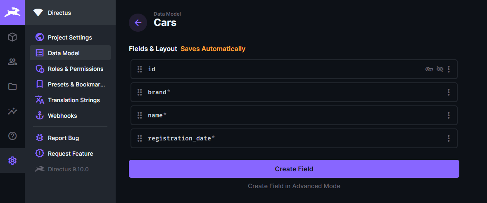
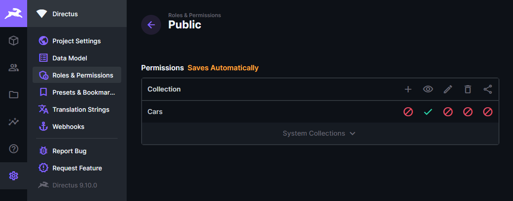

# Directus (DEFEKT stand: 21.04.2022)

Startet [Directus](https://duckduckgo.com).

Befehl zu starten: ```docker-compose up``` (muss in diesem Ordner ausgeführt werden)

Directus ist danach auf dem Port 8055 erreichbar.

Name der Variable | Wert
---|---
KEY | 255d861b-5ea1-5996-9aa3-922530ec40b1
SECRET | 6116487b-cda1-52c2-b5b5-c8022c45e263
ADMIN_EMAIL | admin@admin.com
ADMIN_PASSWORD | admin

## Frontend

Das Frontend läuft auf Port 3000. Es funktioniert aber nur, wenn folgende Punkte abgearbeitet wurden.

__1. cars Collection erstellen__

Erstellen sie eine Collection die ```cars``` heißt. Sie muss mindestens folgende Felder aufweisen:

Feldname | Type | Bemerkung
---|---|---
id | integer | Wird automatisch erzeugt, einfach Standardeinstellung belassen
brand | string |
name | string |
registration_date | integer



__2. Berechtigungen für collection__

Setzen sie für die erstellte cars-Collection die Berechtigung für Public auf lesen

