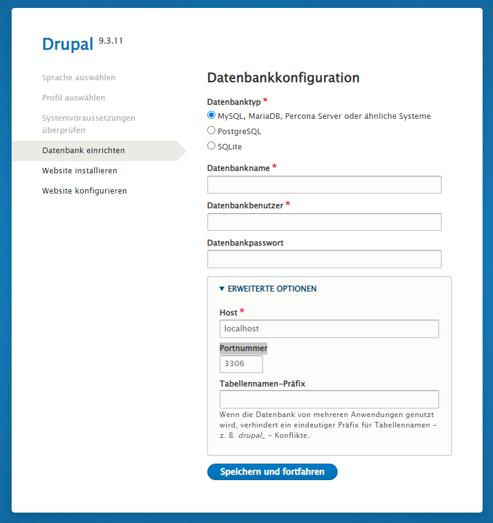

# Drupal

Startet [Drupal](https://www.drupal.org/), zusammen mit einer MySQL Datendank und PHPMyAdmin. 

Befehl zu starten: ```docker-compose up``` (muss in diesem Ordner ausgeführt werden)

Drupal ist danach auf dem Port 8080 und PHPMyAdmin auf dem Port 8081 erreichbar.

Name der Variable | Wert
---|---
Datenbankname | drupal
Datenbankbenutzer | drupal
Datenbankpasswort | drupal
Host | mysql
Portnummer | 3306

