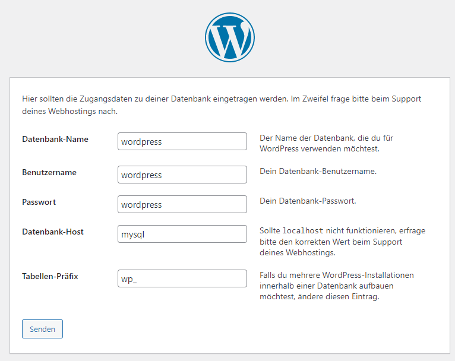

# Wordpress

Startet [Wordpress](https://wordpress.org), zusammen mit einer MySQL Datendank und PHPMyAdmin. 

[Entwickler Dokumentation](https://codex.wordpress.org/)

Befehl zu starten: ```docker-compose up``` (muss in diesem Ordner ausgeführt werden)

Wordpress ist danach auf dem Port 8080 und PHPMyAdmin auf dem Port 8081 erreichbar.

Name der Variable | Wert
---|---
Datenbank-Name | wordpress
Benutzername | wordpress
Passwort | wordpress
Datenbank-Host | mysql
TabellenPräfig | wp_

